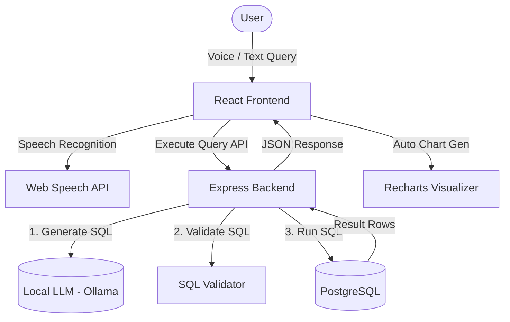

# VoxQuery - Voice-to-Visualization Analytics Platform

VoxQuery is an elegant, containerized, speech-driven data analytics platform. It allows users to dictate analytical queries in plain English (e.g. *"Show total sales by product category"*), compiles the speech to SQL using a local LLM, validates and executes it against a PostgreSQL sandbox, and visualizes the results dynamically using customized Recharts charts.

---

## 🏗️ Architecture & Flow Diagram

The application is split into three containerized services coordinated by Docker Compose:

1. **Frontend (React + TypeScript)**: Scaffolded with Vite. Incorporates browser Web Speech API for transcription, custom CSS glassmorphism styling, and Recharts.
2. **Backend (Express + TypeScript)**: Orchestrates LLM prompt compiling, restricts SQL execution to read-only SELECT commands on whitelisted tables, and automatically recommends visualization charts.
3. **Database (PostgreSQL 15)**: Holds user credentials, SQL history logs, and sandbox retail tables.



---

## 🗄️ Database Schema & Sandbox Data

To ensure out-of-the-box utility, the Postgres container is pre-seeded with a retail transaction database containing 3 primary tables:

1. **`products`**: Product catalog details.
   - `id` (INT, Primary Key)
   - `name` (VARCHAR)
   - `category` (VARCHAR)
   - `price` (DECIMAL)
   - `stock` (INT)
2. **`customers`**: Profiles of buyers.
   - `id` (INT, Primary Key)
   - `name` (VARCHAR)
   - `email` (VARCHAR)
   - `city` (VARCHAR)
   - `join_date` (DATE)
3. **`sales`**: Ledger recording purchases.
   - `id` (INT, Primary Key)
   - `product_id` (INT, Foreign Key)
   - `customer_id` (INT, Foreign Key)
   - `quantity` (INT)
   - `sale_date` (DATE)
   - `total_amount` (DECIMAL)

---

## 🔒 Security & SQL Validation Engine

Since the SQL queries are generated dynamically by an AI model, the backend employs a rigorous multi-tier **SQL Validation Engine** before executing queries:

* **SELECT-Only Enforcement**: Rejects any queries containing destructive SQL commands (`INSERT`, `UPDATE`, `DELETE`, `DROP`, `ALTER`, `TRUNCATE`, `CREATE`, etc.).
* **Single Statement Check**: Blocks multiple SQL statements separated by semicolons (preventing semicolon injection).
* **Table Whitelisting**: The query is parsed to extract table targets. Only whitelisted sandbox tables (`products`, `customers`, `sales`) are permitted. Access to database catalogs (`information_schema`, `pg_*`) or user tables is strictly blocked.

---

## 🚀 Getting Started

### 📋 Prerequisites
* [Docker Desktop](https://www.docker.com/products/docker-desktop/)
* [Ollama](https://ollama.com/) (running locally)

### 1. Configure the LLM (Ollama)
Pull the default model (e.g. `llama3` or `sqlcoder`) on your host machine:
```bash
ollama pull llama3
```
Ensure Ollama is running at `http://localhost:11434`.

### 2. Start the Platform
Navigate to the root directory and run Docker Compose:
```bash
docker-compose up --build
```
This command spins up:
* Database container on `localhost:5432` (pre-seeded)
* Express Backend container on `localhost:5000`
* React Frontend container on `localhost:5173`

Open **[http://localhost:5173](http://localhost:5173)** in your browser.

---

## 🧪 Testing

### Running SQL Validation Unit Tests
To verify that the security validator blocks malicious code and approves safe SQL commands, run the unit test suite inside the backend folder:
```bash
cd backend
npm install
npm run test:sql
```
This runs `src/tests/sql-validator.test.ts` against various edge cases.


### Running the application locally

Start PostgreSQL

Either:

Install PostgreSQL locally, or
Keep only the database in Docker

Example:

```bash
docker-compose up db
```

This starts only the PostgreSQL container.

Start Backend
```bash
cd backend
npm install
npm run dev
```

Typically runs on:

http://localhost:5000

with Nodemon auto-reloading when you save files.

Start Frontend
```bash
cd frontend
npm install
npm run dev
```

Typically runs on:

http://localhost:5173

with Vite hot reload.

Start Ollama
```bash
ollama serve
```

(or let it run in the background)